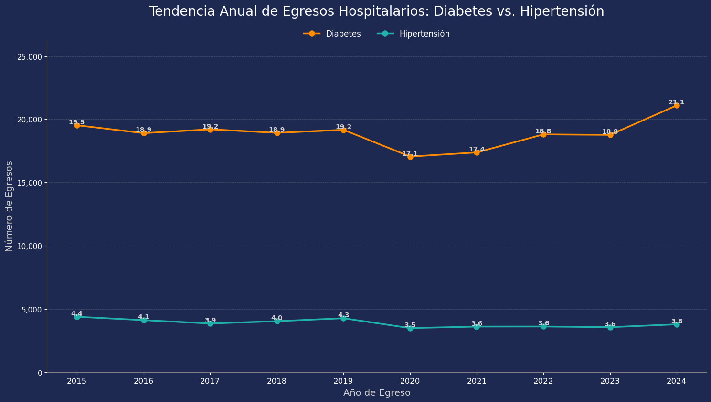
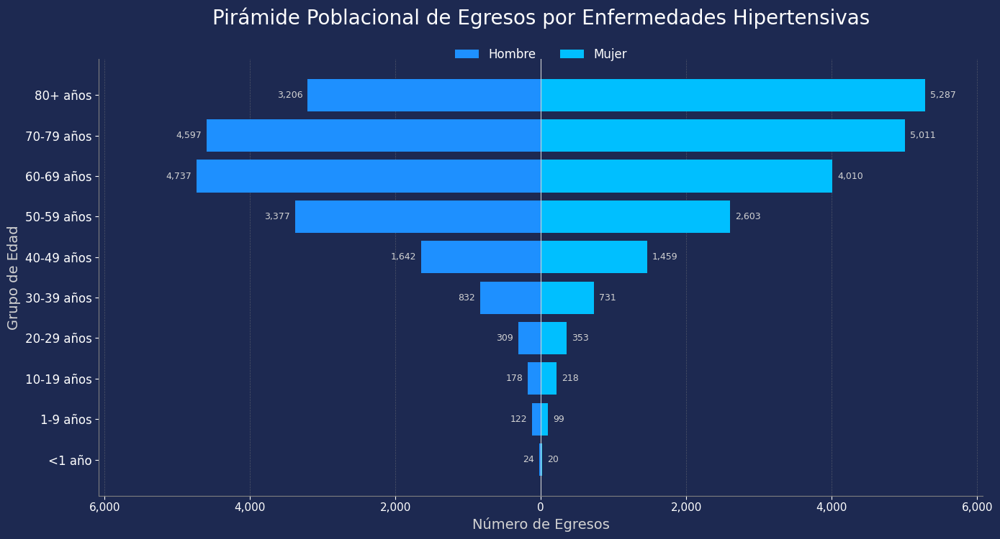
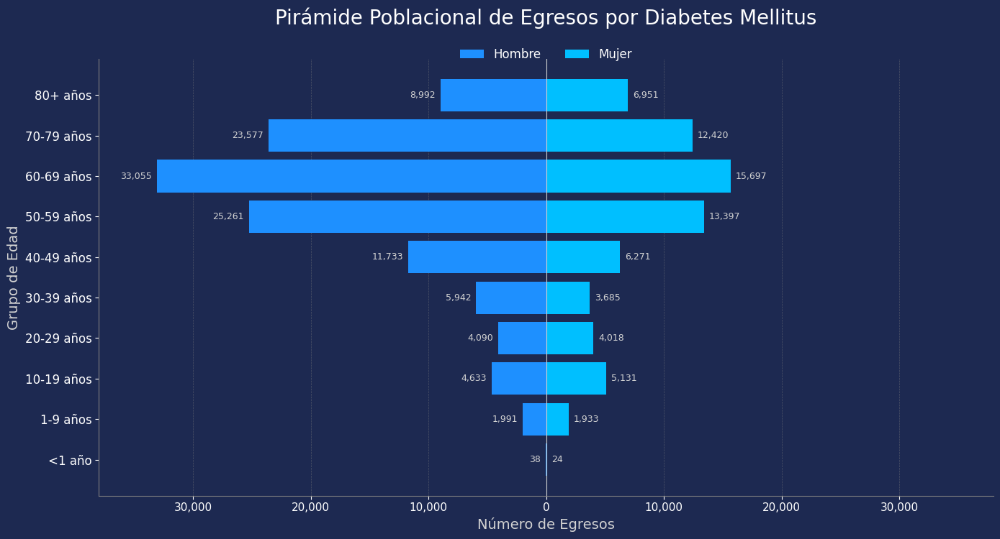
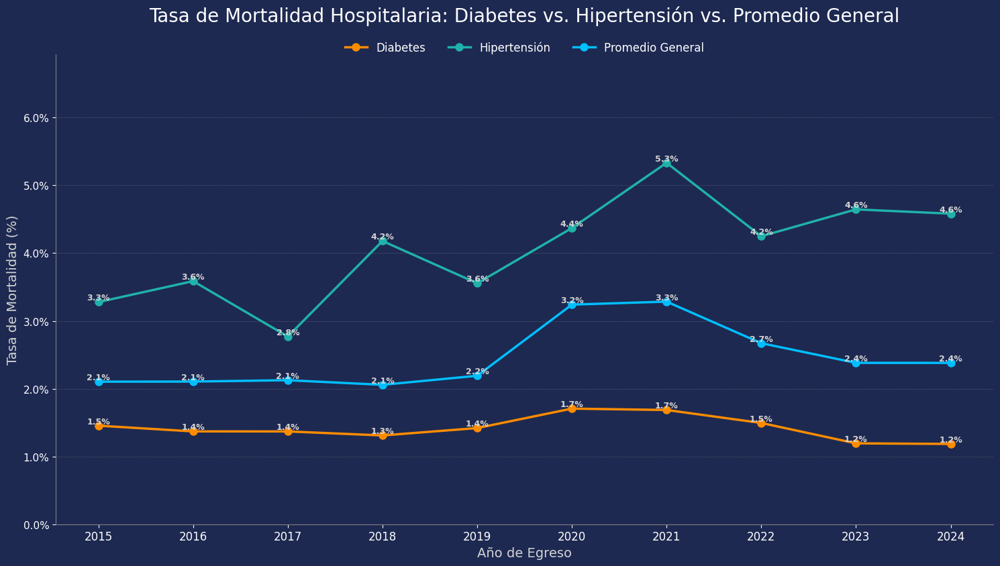
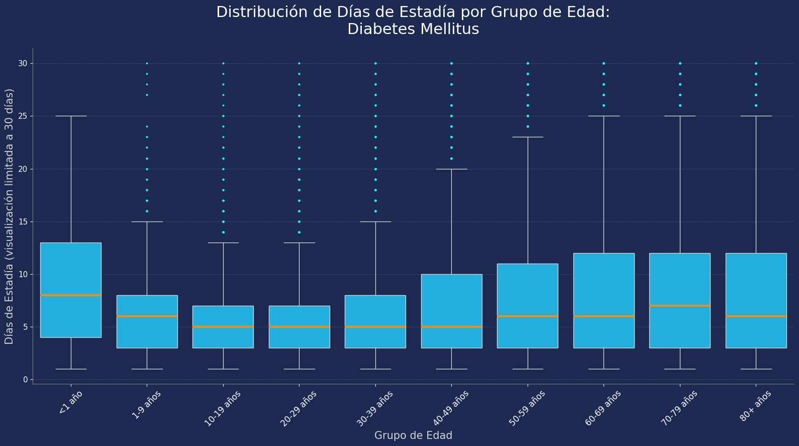
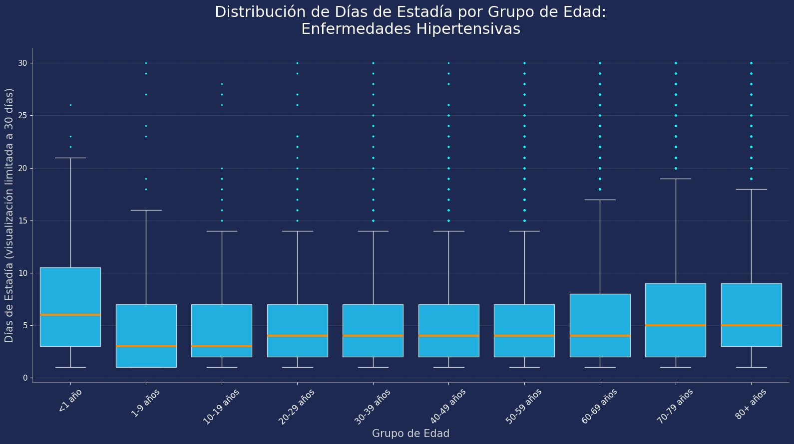

# Perfil_Epidem_Egresos_Hospitalarios_Chile_2015-2024
EDA y desarrollo de un Dashboard a partir de los datos de más de 15 millones de egresos hospitalarios en Chile durante el periodo 2015-2024.
El objetivo principal es identificar tendencias, perfiles demográficos y geográficos de pacientes con Diabetes Mellitus e Hipertensión Arterial. El proyecto abarca desde la recolección y limpieza de datos hasta la creación de un perfil epidemiológico y la visualización de hallazgos clave.

## Visualizaciones Desatacadas:

## Metodología del Análisis
El presente análisis se llevó a cabo siguiendo un flujo de trabajo estructurado para garantizar la calidad, consistencia y reproducibilidad de los resultados. Las principales etapas metodológicas fueron las siguientes:

### 1. Adquisición y Consolidación de Datos
La fuente de datos principal corresponde a los registros de Egresos Hospitalarios del Sistema Público de Salud de Chile, disponibles públicamente a través del Departamento de Estadísticas e Información de Salud (DEIS). Se consolidaron los microdatos anuales desde 2015 hasta 2024 en un único conjunto de datos. Adicionalmente, se utilizó el diccionario de códigos de diagnóstico CIE-10, también proporcionado por la misma fuente, para el enriquecimiento de los datos.

### 2. Limpieza y Preprocesamiento de Datos
Se realizó un exhaustivo proceso de limpieza y estandarización para asegurar la integridad del conjunto de datos. Las transformaciones clave incluyen:

- Consistencia Categórica: Se normalizaron y agruparon diversas variables categóricas que presentaban inconsistencias a lo largo de los años:
- SEXO: Se homologaron los códigos numéricos (1, 2) y de texto ('*', 'DESCONOCIDO', 'Intersex') a las categorías finales "Hombre" y "Mujer", excluyendo registros inconsistentes o no especificados.
- GRUPO_EDAD: Se estandarizaron más de 30 formatos de rangos etarios distintos en 10 categorías lógicas y ordenadas (ej. <1 año, 1-9 años, ..., 80+ años).
- PREVISION: Se capitalizaron y agruparon los distintos proveedores de seguros en categorías funcionales (Sistema Público, Sistema Privado, Fuerzas Armadas y de Orden, etc.).
- PAIS_ORIGEN: Se estandarizó la nacionalidad en dos grupos ('Chileno', 'Extranjero') para mantener la consistencia con los registros de años anteriores.
- Conversión de Tipos: Se convirtieron las columnas ANO_EGRESO y DIAS_ESTADIA a tipos de datos numéricos para permitir cálculos y análisis temporales.

### 3. Enriquecimiento de Datos con Diccionario CIE-10
Para traducir los códigos de diagnóstico en descripciones legibles, el conjunto de datos de egresos fue enriquecido mediante dos operaciones de unión (merge) con la tabla del diccionario CIE-10. Se realizaron uniones por separado para el diagnóstico principal (DIAG1) y el secundario (DIAG2), añadiendo información descriptiva como la subcategoría, categoría, grupo y capítulo del diagnóstico.

### 4. Análisis y Visualización
El análisis se centró en un subconjunto de datos filtrado por los grupos de diagnóstico de "Diabetes mellitus" y "Enfermedades hipertensivas" como causa principal de hospitalización (GRUPO_DIAG1). Se calcularon diversas métricas, tales como tendencias anuales, promedios de días de estadía y tasas de mortalidad. Todas las visualizaciones se generaron en Python utilizando las librerías Matplotlib y Seaborn, aplicando una línea estética consistente para facilitar la interpretación y la presentación de los resultados.

### 5. Desarrollo de Dashboard Interactivo en Power BI
Para complementar el análisis estático y permitir una exploración más amplia de los datos, se desarrolló un panel de control interactivo en Microsoft Power BI. Se importó el conjunto de datos ya limpio y procesado para construir las visualizaciones clave del estudio, incluyendo la replicación de gráficos complejos como la pirámide poblacional a través de scripts de Python integrados. La principal funcionalidad del panel es su carácter dinámico, logrado mediante el uso de segmentaciones de datos (slicers) que permiten al usuario final filtrar todo el informe y observar los mismos análisis para cualquier capítulo, grupo o categoría de diagnóstico de interés, extendiendo así el alcance del estudio más allá de las patologías inicialmente analizadas.

## Stack Tencológico:
- 🐍 Python (Pandas, Numpy, Matplotlib, Seaborn, GeoPandas)
- 📓 Jupyter Notebook
